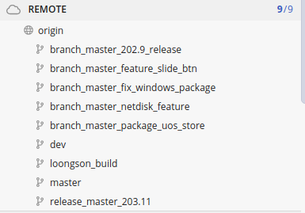

# Linux客户端

## 打包机

Linux(x86_64) ubuntu16备注这里不能安装版本太高的gcc: 

10.0.0.55 root 123YES!!

这个打包机主要用于打包Linux下的x86的deb以及rpm的包


**注意**
1. 如果打包机掉线了需要运行一下```/media/xinda/\u65b0\u52a0\u5377/jenkins_qt_linux_remote```下的run_slave.sh执行一下启动


Windows(x86_64):
10.0.0.69 Administrator 123YES!!

打Windows的x86的安装包


## 国产化机器
**UOS(MIPS64EL龙芯)**
xinda 123456
**UOS(ARM64鲲鹏920)备注：后面可能需要规范**

huawei 123456

> 这个系统主要用于用于打包ARM64的UOS打包机

**银河麒麟(ARM64鲲鹏920)**

sancog sancog123

> 银河麒麟的ARM64机器主要是为了解决在glibc2.23版本下无法运行glibc2.28版本的安装包，会出现跨libc兼容问题，因此在这个机器上使用使用自己编译出来的qt5.6.2(包括webengine模块)来重新编译youduqt

**UOS(ARM64麒麟990)**

账号密码：

huawei 123456

要专门适配的问题是因为此芯片下的桌面是基于wayland与xcb的有不同，因此需要专门适配一下，这里注意一定要把qt相关plugins下的wayland相关的so库全部打包到安装中，同时记得查看程序是否以xcb兼容模式启动，不然导致窗口位置无法移动等严重问题 因此一定要加上词句，如果应用是需要在wayland上进行运行的


```bash
export QT_QPA_PLATFORM='xcb' # 表示以xcb的兼容模式进行启动
```

# 编译环境以及打包

## 概述
编译环境的搭建主要分成几个点：
　

### Qt环境
Windows采用的是Qt5.7.2版本(jgapi的asio升级到高版本会有障碍)
Linux(x86)采用的版本是Qt5.14.2 (之前升级上来主要要兼容音视频的QtBrowser)
### GCC版本

### 打包工具
#### Linux
在linux无论什么架构上都是采用[linuxdeployqt](https://github.com/probonopd/linuxdeployqt)
因此需要在国产化架构上进行打包需要升级到linuxdeployqt release版本的编译出来然后将linuxdeployqt移动到/usr/bin目录下

注意事项:

在编译linuxdeployqt的时候需要避免高版本的gcc编译linuxdeployqt，如果是高版本在编译的时候会报错，这时候需要屏蔽掉相应的代码：
```cpp
// openSUSE Leap 15.0 uses glibc 2.26 and is used on OBS
    /*if (strverscmp (glcv, "2.27") >= 0) {  //注释版本检查
      qInfo() << "ERROR: The host system is too new.";
      qInfo() << "Please run on a system with a glibc version no newer than what comes with the oldest";
      qInfo() << "currently still-supported mainstream distribution (xenial), which is glibc 2.23.";
      qInfo() << "This is so that the resulting bundle will work on most still-supported Linux distributions.";
      qInfo() << "For more information, please see";
      qInfo() << "https://github.com/probonopd/linuxdeployqt/issues/340";
      return 1;
    }*/
```
还有如果必要，需要安装：
```cpp
sudo apt install patchelf
```
参考：

https://blog.csdn.net/weixin_44713381/article/details/107894339
https://cloud.tencent.com/developer/article/1720779


#### Windows
在Windows上需要用到的是windeployqt这个官方提供的工具进行打包，需要注意一些第三方依赖需要自己移植的相应目录下

## Linux打包概述

### 

## Windows打包概述

## Mac概述


# 打包

# 程序结构

## 分支情况
  
- master 分支主要为维护最新的代码分支
- dev 分支为之前的规范，现在已经废弃
- longson_build 之前中标麒麟下mips的打包分支，现在可以删除
- branch_master_netdisk_feature 为网盘的功能分支
- branch_master_package_uos_store 为打包uos下的的打包，主要是uos下打包目录下不允许有usr目录，而debian的系统则需要，因此专门维护这条分支用户uos下x86_64的打包
- release_master_203.11 版本为203.11的特性包分支
- branch_master_202.9_release 为202.9的补丁包
- branch_master_fix_windows_package 主要为用于Windows的打包，主要处理了一下quazip这个库zlib依赖问题
- branch_master_feature_slide_btn 主要处理收缩侧边栏，效果不太好，故没有合入主分支


# 注意事项

# 问题